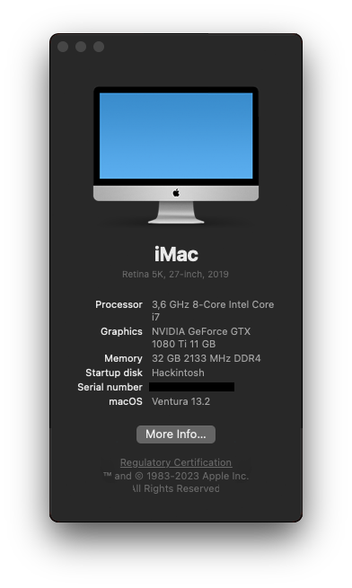

<h1 align="center"> Personal Hackintosh Build</h1>

  

## Software

- OpenCore: 0.8.8
- OCLP: 0.6.1
- MacOS: 13.2 (Ventura)

## Hardware

- **Motherboard**: Asus Z390-F
  - Bluetooth is handled by an USB adapter
- **CPU**: Intel Core i7-9700K
- **GPU**: Nvidia GeForce GTX 1080 Ti
- **RAM**: Corsair 32GB DDR4 Vengeance LPX
- **Storage**:
  - Samsung 970 Evo 250GB, M.2
  - Samsung 960 Evo 250GB, M.2
  - Samsung 860 Evo 500GB, 2.5"
  - Samsung 860 Evo 500GB, 2.5"

## Configuration

- Everyone's system will have different requirements, `config.plist` will most likey be different
- Values that are `{{REPLACE_ME}}` or `00000000 0000` must be replaced with actual values from new SMBios.

## Known issues

- Hardware acceleration not working
- Screen recording is broken
- AMFI is disabled, apps won't ask for permissions
    - Solution: use [tccplus](https://github.com/jslegendre/tccplus)
- Chromium based apps won't work
    - Solution: add `ipc_control_port_options=0` to `boot-args`

## Useful links

- [BIOS Settings](https://dortania.github.io/OpenCore-Install-Guide/config.plist/coffee-lake.html#intel-bios-settings)
- [Generate new `PlatformInfo` values](https://dortania.github.io/OpenCore-Install-Guide/config.plist/coffee-lake.html#platforminfo)
- [OpenCore Sanity Checker](https://opencore.slowgeek.com/)
- [OCLP GPU patching](https://elitemacx86.com/threads/how-to-enable-nvidia-graphics-on-macos-monterey-and-later.925/)
